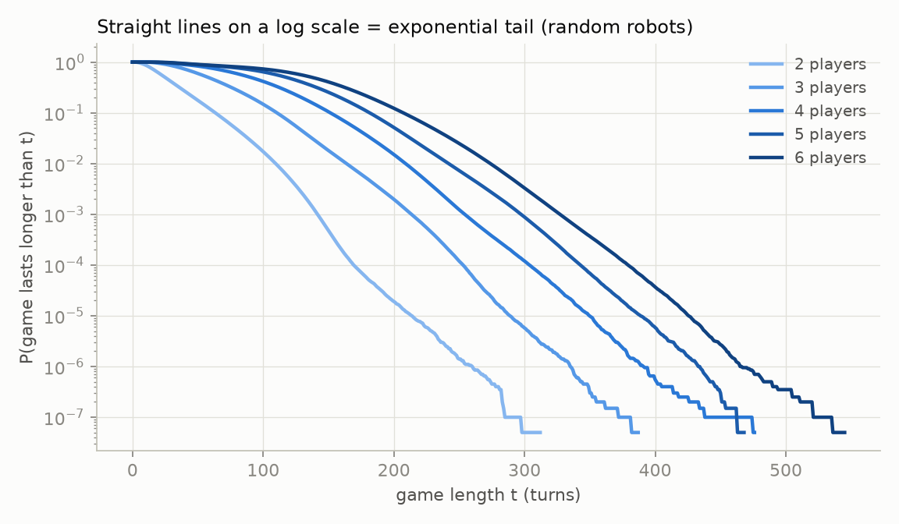
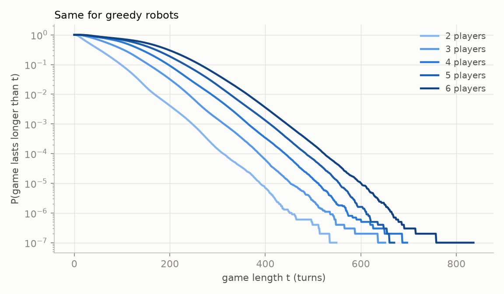
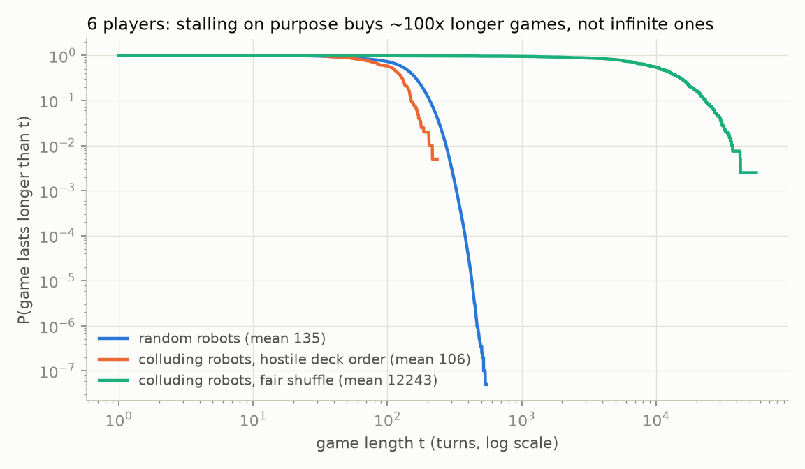
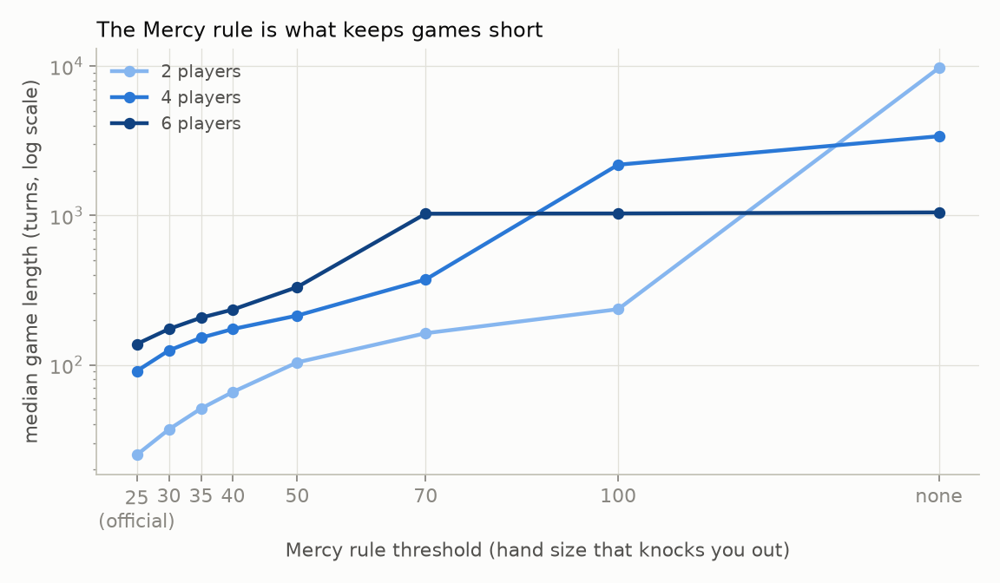

# UNO Show 'Em No Mercy: is it solved, and is the average game infinitely long?

## Short answer

1. **It is not solved.** Nobody has solved No Mercy, or even classic UNO, in any game-theoretic
   sense: there is no known optimal strategy, equilibrium or game value. Strategy clearly
   matters. In our tournaments a simple greedy bot beats random play 67–33 one-on-one, and a
   Monte Carlo search bot beats the greedy bot 74–26.
2. **The mean game length is finite** for any sensible robotic play. Under the official rules and
   with no turn cap we simulated 100 million games of random play (20 million for each of 2–6
   players) and 50 million of greedy play. Every one ended. The average ran from 32 turns
   (2 random players) to 157 turns (6 greedy players), and the longest of the 150 million games
   was 837 turns. The chance that a game is still going falls off exponentially, halving every
   10 to 24 turns. We also proved that, for any fixed strategy, the only two possibilities are
   "finite mean with an exponential tail" and "a positive chance of never ending". There is no
   heavy-tailed middle ground that more compute could uncover.
3. **Human-like players with personalities don't change this.** AI agents played eight full games
   in character: a shark, a cautious grandpa, a chaos gremlin, a grudge holder, a peacekeeper,
   an engineer, and whole tables of players whose only goal was to make the game last forever.
   Every game ended, in 22 to 152 turns. The two "never-ending" tables finished in 97 and 69
   turns. Rule-based versions of the same personalities played 1.6 million games, and all of
   them ended too (longest: 1,369 turns).
4. **It can be genuinely infinite if you drop the Mercy rule** (a house rule, not the official
   game). Hands can then soak up nearly the whole deck, and we caught games in provably endless
   loops. Under the official rules, robots that collude to stall stretch games to about 12,000
   turns on average at 6 players, but every such game we simulated still ended. Their lengths
   look exponential, with no "safe forever" plateau. Whether *perfect* collusion could stall
   forever comes down to a precise, finite question that we could not settle.

## 1. Is it solved?

In game theory a game is *solved* when the result of perfect play is known (ultra-weakly
solved), when a strategy achieving it from the opening is known (weakly solved), or when perfect
moves are known from every position (strongly solved). For a game with hidden cards, chance and
more than two players, "solved" would mean computing an equilibrium. Nothing like that exists
for No Mercy or for classic UNO:

- **Complexity results cover toy versions only.** Demaine et al., *The Complexity of UNO*
  (arXiv:1003.2851; FUN 2010; TCS 2014), study a perfect-information abstraction with colours
  and numbers only. Solitaire UNO is NP-complete there, and uncooperative two-player UNO is in P.
  Real UNO has hidden hands, a shuffled deck and action cards. No Mercy adds stacking, hand
  swaps, Discard All, Roulette and the Mercy rule, none of which appear in those models.
- **The state space is enormous.** RLCard puts even simplified two-player classic UNO at about
  10^163 information sets. Our own bound on No Mercy's card-level states is about 10^86 for 2
  players and 10^132 for 6 ([THEORY.md](THEORY.md)).
- **Published strategy work is heuristic.** It consists of RL agents, Monte Carlo bots and
  heuristic ladders. The best classic-UNO study we found explicitly does not claim a Nash
  equilibrium. About 90 No Mercy code repositories on GitHub were checked: none has a solver.

Strategy clearly matters, so the game is far from trivially "solved by playing anything":

| Match (official rules) | Games | Win rate of the first-named bot | Equal-skill baseline |
|---|---:|---:|---:|
| greedy vs random, 2 players | 400,000 | 67.3% | 50% |
| greedy vs 3 random, 4 players | 400,000 | 49.7% | 25% |
| Monte Carlo vs greedy, 2 players | 3,000 | 73.9% (±1.6) | 50% |
| Monte Carlo vs 3 greedy, 4 players | 1,000 | 39.1% (±3.0) | 25% |

*Greedy* is a hand-written heuristic. It attacks small hands, dumps the colour it is long in,
stacks penalties and saves wilds. *Monte Carlo* re-deals the unseen cards at random,
consistent with what it can see, plays each candidate move out 48–64 times with greedy players,
and picks the move that wins most. Neither is optimal; they show only that play quality matters
a lot.

## 2. The rules we used

The official rulebook text is Mattel's HWV18 instruction sheet (2023). Every rule and every
ambiguity is in [RULES.md](RULES.md), with sources. The choices that matter most for length:

- **Strict must-play.** If you can play, you must. If you can't, you draw until you get a
  playable card and must play it.
- **Stacking by value.** Any Draw card worth at least the last one can be stacked, whatever its
  colour. Otherwise you take the whole total and lose your turn.
- **Two-player Wild Reverse Draw 4 hits whoever played it.** The sheet says so explicitly. We
  apply it whenever exactly two players remain.
- **Wild Color Roulette.** The victim names a colour and keeps every card revealed until that
  colour appears.
- **Mercy rule.** Reaching 25 cards knocks you out immediately, even in the middle of a draw.
  Your cards go back into the deck at the next reshuffle.
- **Ending.** The game ends when someone plays their last card or only one player is left.
- **The deck.** 168 cards. The sheet gives no breakdown, so we use the most-cited one and test
  two others (§8).
- **A turn** is each time a player acts: plays, draws until playable, takes a penalty, or
  reveals cards as a Roulette victim. There is no turn cap anywhere.

"Robots" never forget to shout UNO, never misdeal, and play forever if the rules allow it.

## 3. How long is a game when robots just play?

A fast C simulator ([sim/nomercy.c](sim/nomercy.c)) plays complete games with no turn cap. The
numbers below are for the default rules and deck.

**Random robots** pick uniformly among their legal moves: playable card types, wild colours,
7-swap targets, and stack-or-take.

| Players | Games | Mean turns (±SE) | Median | 99th pct | 99.99th pct | Longest game | Ended by someone going out |
|---:|---:|---:|---:|---:|---:|---:|---:|
| 2 | 20,000,000 | 31.90 ± 0.005 | 25 | 110 | 170 | 313 | 8% |
| 3 | 20,000,000 | 64.51 ± 0.008 | 58 | 164 | 253 | 388 | 17% |
| 4 | 20,000,000 | 94.25 ± 0.010 | 91 | 209 | 304 | 477 | 26% |
| 5 | 20,000,000 | 117.98 ± 0.011 | 118 | 242 | 343 | 469 | 32% |
| 6 | 20,000,000 | 135.47 ± 0.013 | 138 | 274 | 380 | 546 | 35% |

**Greedy robots** play the heuristic described in §1. They stack and attack more, and games run
a little longer:

| Players | Games | Mean turns (±SE) | Median | 99th pct | 99.99th pct | Longest game | Ended by someone going out |
|---:|---:|---:|---:|---:|---:|---:|---:|
| 2 | 10,000,000 | 45.03 ± 0.012 | 33 | 168 | 312 | 550 | 23% |
| 3 | 10,000,000 | 84.14 ± 0.017 | 74 | 239 | 387 | 652 | 38% |
| 4 | 10,000,000 | 115.06 ± 0.020 | 111 | 287 | 441 | 698 | 47% |
| 5 | 10,000,000 | 138.17 ± 0.023 | 136 | 326 | 485 | 671 | 49% |
| 6 | 10,000,000 | 157.41 ± 0.026 | 158 | 363 | 523 | 837 | 52% |

Most random games end by the Mercy rule. At 2 players, 92% of random games end with a knockout;
the average 6-player random game knocks out 3.9 of the 6 players before someone wins.



The picture shows, for each player count, the fraction of games still going after t turns, on a
log scale. On a log scale an exponential tail is a straight line, and that is what the curves
become. Fitting the far tail (from P = 10^-2 down to the last few hundred games):

| Players | Random: survival halves every | Greedy: survival halves every |
|---:|---:|---:|
| 2 | 9.9 turns | 21.6 turns |
| 3 | 12.3 turns | 22.1 turns |
| 4 | 14.3 turns | 22.6 turns |
| 5 | 14.4 turns | 23.5 turns |
| 6 | 15.4 turns | 23.8 turns |

(R² ≥ 0.990 for every fit.) A heavy tail, the kind that can make an average infinite, would bend
the other way. On a log-log plot its slope would stay constant. Here the local log-log slope
steepens across every fit window, for example from about 8 to about 19 for 4 random players.
Every one of the 150 million games ended.



## 4. Human-like players: AI agents with personalities

Random and greedy robots are not people. To see how long games run when players have
personalities, grudges and goals, we had AI agents play complete games in character, one
decision at a time, with no turn cap. Each player saw only what a person at the table would see:
their own hand, the top card, everyone's hand size, the last dozen table events, and their own
private notes. They used the notes to track grudges and plans across turns. A small engine
([humans/engine.py](humans/engine.py)) enforces the official rules and plays forced moves. Over
20,000 random 4-player games it averages 94.4 ± 0.3 turns, against 94.25 for the main
simulator. Every real choice went to a separate AI call playing that character, 433 choices
across the eight games.

The seven personalities ([humans/personas.md](humans/personas.md)):

| Name | Personality |
|---|---|
| Maya | *The Shark*: plays only to win, hits the leader, stacks everything useful |
| Joe | *The Cautious Grandpa*: hates drawing, hoards wilds, avoids penalty wars |
| Tyler | *The Chaos Gremlin*: plays the loudest card, loves Roulette and swaps |
| Priya | *The Grudge Holder*: sensible, but pays back whoever hit her |
| Sam | *The Peacekeeper*: won't knock friends out, takes penalties rather than escalate |
| Leo | *The Engineer*: methodical, keeps a flexible hand, counts colours |
| Zoe, Zara, Zed, Zia, Zach, Zelda | *The Never-Ending Story*: wants the game to last forever and keeps everyone in it |

**Every game ended.** The same tables were also written as rule-based personality bots, with the
same tendencies expressed as simple weighted rules, and played 200,000 times each. That shows
where each AI game falls:

| Table | AI game: turns | How it ended | Same table, 200,000 bot games: mean (longest) | Bot games shorter than the AI game |
|---|---:|---|---:|---:|
| Shark vs Gremlin | 27 | Tyler knocked out (25 cards) | 37 (276) | 48% |
| Grandpa vs Grudge Holder | 22 | Priya knocked out | 45 (376) | 30% |
| Shark, Peacekeeper, Gremlin | 43 | Maya went out; Sam knocked out earlier | 80 (536) | 25% |
| Shark, Grandpa, Gremlin, Grudge Holder | 106 | Priya last standing, 3 knocked out | 106 (487) | 52% |
| Peacekeeper, Engineer, Never-Ending, Gremlin | 90 | Sam last standing, 3 knocked out | 117 (885) | 38% |
| 4 × Never-Ending | 97 | Zed went out; Zara knocked out earlier | 208 (1,116) | 21% |
| Shark, Grandpa, Gremlin, Grudge, Peacekeeper, Engineer | 152 | Leo last standing, 5 knocked out | 158 (757) | 47% |
| 6 × Never-Ending | 69 | Zach went out | 318 (1,369) | 12% |

Logs and each player's private notes are in [humans/games/](humans/games/). The comparison is in
[results/personas/ai_vs_bots.json](results/personas/ai_vs_bots.json).

What this shows:

- **Human-like play did not produce long games.** The AI games ran 22 to 152 turns. Each fell
  between the 12th and 52nd percentile of its table's bot games, so if anything they were a
  little shorter. Eight games cannot measure a mean or a tail; that is what the millions of bot
  games are for. They can show whether personalities change the picture, and they don't.
- **The rule-based bots agree at scale.** All 1.6 million personality-bot games (8 tables ×
  200,000) ended. The longest was 1,369 turns. Every table has an exponential tail, with survival
  halving every 15 to 62 turns (R² ≥ 0.989, steepening log-log slope).
- **Wanting the game to last forever is not enough.** The "Never-Ending" players really did try.
  Their notes say things like *"Taking the +4 again, 22 cards is scary but I still won't pile
  draws on Zed/Zia/Zoe"*. Being gentle backfires in two ways:
  - Absorbing penalties to protect others gets *you* knocked out. Zara took three +4s in a row
    and hit 25 cards at turn 60.
  - Keeping everyone's hands small makes it easy for someone to run out, and the must-play rule
    then forces the last card down. Zoe played a 0 at turn 65 *"to avoid Draw 2 stacking risk
    with Zia at 1 card"*. The 0 passed every hand one seat on, which gave Zia's one card to
    Zach. Four turns later Zach had to play it and won. In the 4-player game Zed held only
    Blue Draw 2s and was forced to play his last one.

  The rule-based stallers last longer (208 and 318 turns on average) because they play on
  mechanically with bigger hands, not because they are nicer. They still always finish.
- **Why compute is not hiding an infinite mean.** For a fixed way of playing, the maths in §5
  leaves only two options: a finite mean with an exponential tail, or a positive chance that a
  game never ends. A positive chance of never ending would show up as games that refuse to
  finish, and none did in any of these runs. The tails also bend the way an exponential does,
  not the way a heavy tail would. A few games by thoughtful players can't settle the tail. A few
  million games by simple players can, and the thoughtful players' games land inside the same
  distribution.

## 5. Why the mean is finite: the math

Simulation can't prove that something never happens, so we also worked out the mathematics.
[THEORY.md](THEORY.md) has the statements; [docs/proofs/](docs/proofs/) has the full proofs,
each checked by independent referees trying to break it.

**The game is a finite Markov chain.** Take the "state" to be: who is still in, every hand,
what is in the draw and discard piles, the top card and colour, whose turn it is, the
direction, and any pending penalty. Nobody sees the order of the draw pile, so the next card is
always uniformly random among the cards in it, whatever anyone remembers. That makes the game
a finite-state Markov decision process, with fewer than 10^132 states. The Mercy rule
guarantees no deadlock: every hand holds at most 24 cards, so at least 23 cards are always
available to draw.

**The dichotomy.** For such a process there are exactly two possibilities.

- **Either** from every reachable position, whatever the players do, the next few draws can end
  the game with probability at least some fixed ε > 0. Then the game ends with probability 1
  under *every* strategy (competitive, colluding, with or without full information), the tail
  is exponential, and the mean is finite.
- **Or** there is a reachable set of positions where some choice of moves keeps the game inside
  the set whatever card is drawn. Then colluding robots that steer into it can make the game
  last forever with positive probability, so the mean is infinite.

For any *fixed* strategy the two cases are also the only ones: either the mean is finite with an
exponential tail, or there is a positive chance of never finishing. A heavy tail with an
infinite mean cannot happen, so it is not something that more simulation could miss.

**What that means for ordinary robots.** For a fixed strategy the mean is finite exactly when,
from every position the strategy can reach, the end of the game can still be reached.

- **Random robots** make every legal move with positive probability, so the condition becomes
  "there is no trap": no reachable position from which no sequence of moves and draws can end
  the game. A full proof that no trap exists under the official rules is still open.
  The Roulette argument below removes the most natural traps, but not all of them.
- **The numbers agree.** 100 million random games never got stuck, and their tails are
  exponential.

**Why a trap is so hard to build: the Wild Color Roulette.** The victim of a Roulette names a
colour and keeps every card revealed until that colour appears. Suppose a Roulette is played
while the draw pile is empty. The victim names the colour that is rarest among the cards outside
the players' hands. The discard pile is reshuffled, and in some ordering every card of the other
colours comes up first. The other hands hold at most 24 cards each, so at least 47 − h cards are
outside the hands, where h is the victim's hand size. At least three quarters of them are
off-colour, which is more than the 24 − h needed to push the victim to 25 cards. So there is a
positive-probability knockout waiting at the end of every trip through the deck, and a similar
one whenever the draw pile has at least 32 cards.

## 6. Can robots make it last forever on purpose?

Suppose every robot cooperates to keep the game going as long as possible. They share full
knowledge of every hand, but not the order of the shuffled deck. The dichotomy in §5 says this
is the only way the average could become infinite: they would need a set of positions from
which they can always respond safely, whatever card comes up.

We built the strongest stalling robots we could. They search every forced continuation a few
moves ahead, including penalty chains, Wild Draw cards forced onto a neighbour, and Roulette
reveals. Cards a player receives but that the search cannot know are modelled as unplayable
"phantom" cards. The robots then pick the move with the smallest chance of the game ending,
breaking ties toward comfortable hand sizes (for example, never letting anyone sit on 1 card or
near 25). A pure worst-case risk model worked best. We ran them two ways: with a fair shuffle,
which is the real game, and against a hostile deck that deals the worst possible card at every
draw.

| Players | Colluders, fair shuffle: mean turns (median, longest) | Colluders, hostile deck: mean turns | Random robots: mean turns |
|---:|---|---:|---:|
| 2 | 364 (257, 2,415) | 10 | 32 |
| 3 | 3,061 (2,165, 18,568) | 21 | 65 |
| 4 | 4,360 (3,439, 22,698) | 31 | 94 |
| 5 | 7,739 (6,939, 29,168) | 57 | 118 |
| 6 | 12,243 (10,767, 55,873) | 106 | 135 |

(400 fair-shuffle games and 200 hostile-deck games per player count.)



- Collusion stretches games 10–90× under a fair shuffle, but **every game still ended**.
- The lengths look exponential. The standard deviation is 0.7–0.95 of the mean, and about
  e^-2 ≈ 13% of games outlast twice the mean. That is a roughly constant per-turn chance of
  ending, with no plateau of games that go on "forever".
- Against a hostile deck the colluders die within a few dozen turns. The deck has three weapons.
  It can flood a player who has to draw until playable with unplayable cards. It can pick the
  forced card at the end of such a draw, for example a Roulette played onto the next player,
  who is then flooded. And it can load penalty draws with Roulettes that must eventually be
  played.
- Deeper search kept buying longer games (4-player means went 478 → 1,079 → 1,458 → 1,897 → 5,576
  as we added search depth and phantom continuation). So these numbers are lower bounds on
  what perfect colluders could do, not the ceiling.

**Status.** Whether a perfect colluding strategy could stall forever is the question of
whether a reachable safe set exists. That is a finite graph problem on up to ~10^132 states,
far too large to compute. It remains open.

## 7. Without the Mercy rule it really can be infinite

The Mercy rule is what keeps enough cards in circulation. Switch it off (a house rule) and hands
can swallow almost the whole deck. We ran 100,000 random games per player count with no Mercy
rule and an exact loop detector. It stops a game only when the complete state repeats with no
random event and no free choice in between, which proves the game would never end:

| Players | Games | Proven endless | Mean turns | Longest game |
|---:|---:|---:|---:|---:|
| 2 | 100,000 | 0 | 16,096 | 196,792 |
| 3 | 100,000 | 0 | 13,161 | 179,144 |
| 4 | 100,000 | 3 | 5,474 | 75,708 |
| 5 | 100,000 | 5 | 2,794 | 39,171 |
| 6 | 100,000 | 17 | 1,659 | 20,755 |

(An endless game counts only the turns played before its loop was proven, so the means are
those of the games themselves, not of an average that includes infinity.)

Once even one game in a strategy's distribution is provably endless, that strategy's mean is
infinite. So **without the Mercy rule the mean game length of random play is infinite** from 4
players up. Every loop we caught looks the same
([results/no_mercy/cycle_example.txt](results/no_mercy/cycle_example.txt)). All 168 cards except
two are in hands, and the two loose cards are Reverses. Two neighbours can play nothing from their
hands. Each in turn draws the only card available, a "reshuffle" of a single card, is forced to
play it, and reverses play back to the other, forever.

With the Mercy rule, at least 23 cards are always outside the hands, so every loop must pass
through a genuinely random reshuffle, and the Roulette argument in §5 applies.

How much Mercy is enough? Raising the knockout threshold from 25 lengthens games smoothly up to
about 50. Beyond that, games with 4 or 6 players run for hundreds to thousands of turns, and
proven endless loops appear at 6 players (1, 5 and 8 per 40,000 games at thresholds 70, 100 and
"none").



## 8. Does the reading of the rules matter?

The rulebook leaves some points open, and three different deck breakdowns circulate. We re-ran
500,000 games for every combination of reading, policy and player count (54 million games).
Mean turns:

| Rule reading | Random 2p | Random 4p | Random 6p | Greedy 2p | Greedy 4p | Greedy 6p | Longest game |
|---|---:|---:|---:|---:|---:|---:|---:|
| Default (official reading) | 31.9 | 94.3 | 135.5 | 45.0 | 114.8 | 157.6 | 625 |
| Deck: rajatghate5 (38/colour, 16 wilds) | 36.7 | 106.5 | 148.6 | 45.5 | 118.4 | 160.7 | 739 |
| Deck: open-mercy (one 0/colour, 4 plain wilds) | 37.8 | 108.1 | 149.4 | 44.4 | 114.4 | 155.4 | 726 |
| May decline a playable card and draw | 20.6 | 59.7 | 95.2 | same | same | same | 275 |
| Drawn playable card may be kept | 34.7 | 101.7 | 145.2 | same | same | same | 496 |
| Drawn card never played that turn | 37.2 | 108.7 | 154.5 | 49.6 | 126.1 | 172.3 | 800 |
| Stacking must also match colour/symbol | 32.9 | 97.1 | 139.3 | 44.7 | 116.8 | 160.6 | 687 |
| No stacking | 36.0 | 107.3 | 152.7 | 59.7 | 140.6 | 191.4 | 857 |
| Stacking mandatory when able | 28.6 | 85.3 | 123.7 | same | same | same | 436 |
| Roulette colour named by its player | 31.9 | 94.3 | 135.5 | 41.3 | 104.2 | 146.1 | 544 |
| Knocked-out hands shuffled in at once | 31.9 | 102.0 | 156.4 | 45.0 | 126.2 | 174.8 | 687 |
| Knocked-out hands to bottom of pile | 31.9 | 98.0 | 152.5 | 45.0 | 122.4 | 170.6 | 698 |
| Mercy checked at end of the draw action | 31.9 | 93.9 | 134.6 | 45.0 | 114.2 | 156.4 | 710 |
| No 0/7 hand rules | 32.4 | 95.7 | 137.2 | 43.0 | 107.3 | 145.8 | 612 |
| 2p Wild Reverse Draw 4 hits opponent | 32.2 | 94.6 | 135.7 | 42.2 | 113.2 | 155.8 | 638 |

"same": the greedy robot never uses that freedom, so its games are unchanged. The Roulette
variant changes nothing for random robots, because a random robot names a random colour either
way.

Every one of the 54 million games ended. The longest was 857 turns. The readings move the
average by up to about 40%, with "may decline a playable card" the shortest and "no stacking"
the longest, but none comes near making it infinite.

## 9. How we checked the work

- **Two independent implementations.** A separate Python simulator
  ([crosscheck/ref_nomercy.py](crosscheck/ref_nomercy.py)) was written from RULES.md alone. Over
  80 statistical comparisons at 2–6 players (mean, SD, quantiles, tail survival, how games end,
  eliminations, plays, draws, reshuffles), the largest |z| was 2.53. A re-check under the final
  turn definition gave |z| ≤ 2.09 ([crosscheck/COMPARISON.md](crosscheck/COMPARISON.md)).
- **A third engine for the AI games.** [humans/engine.py](humans/engine.py) matches the C
  simulator's random-play averages within one standard error.
- **Invariant checks.** `-debug 1` verifies card conservation, hand limits, pile bookkeeping and
  turn order after every turn, over tens of thousands of games per configuration.
- **Adversarial reviews.** Independent reviewers read the simulator against the rulebook and
  attacked the proofs. Every issue they found was fixed and re-run, including the turn count for
  Roulette victims, a tie-break bias, and the two-player Wild Reverse Draw 4.
- **Sources.** [docs/RESEARCH_NOTES.md](docs/RESEARCH_NOTES.md) records the rulebook sources,
  prior work and the third-party code that was re-run.

## 10. Reproduce

```sh
cd sim && gcc -O3 -march=native -pthread -o nomercy nomercy.c -lm && cd ..
sim/nomercy -p 4 -n 1000000 -threads 4 -seed 1 -policy random        # §3
sim/nomercy -p 4 -n 1000000 -threads 4 -seed 1 -policy greedy        # §3
sim/nomercy -p 6 -n 200000 -threads 4 -seed 1 -seatpol staller,staller,staller,staller,staller,staller   # §4 bots
sim/nomercy -p 4 -n 400 -threads 2 -seed 77 -policy collude -depth 3 -worst 1              # §6 (slow)
sim/nomercy -p 4 -n 200 -threads 2 -seed 78 -policy collude -depth 3 -worst 1 -adv_nature 1 # §6, hostile deck
sim/nomercy -p 6 -n 40000 -threads 1 -seed 31337 -policy random -mercy 1000 -detect_cycles 1 -dumpcap 1   # §7
python3 analysis/tail.py results/final/random_p4.json                # tail fits
python3 analysis/sweep.py sim/nomercy results/variant_sweep.json 500000        # §8
python3 analysis/mercy_sweep.py sim/nomercy results/no_mercy/mercy_sweep.json  # §7
python3 analysis/figures.py
python3 humans/engine.py new --game /tmp/g --players Maya,Tyler      # play a game yourself:
python3 humans/engine.py view --game /tmp/g                          # then 'act' with a choice
python3 humans/compare.py                                            # §4 table
```
